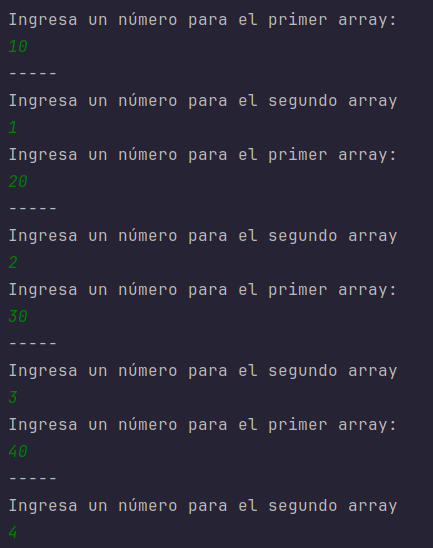
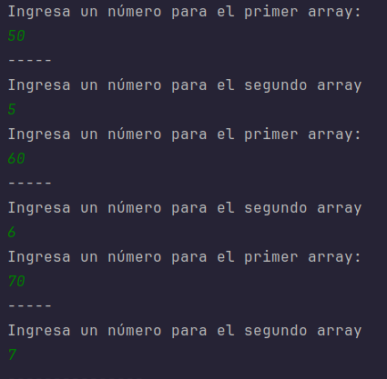
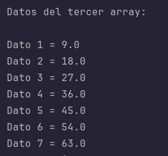
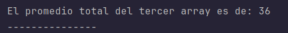

# Actividad 1 - DSA

## Objetivo del proyecto

El objetivo de este proyecto es implementar un programa en Java que permita al usuario ingresar 7 números para dos arreglos unidimensionales. Luego, se crea un tercer arreglo con las diferencias entre los elementos correspondientes de los dos primeros arreglos. Finalmente, se muestran todos los datos del tercer arreglo y se calcula el promedio de estos valores.

## Instrucciones de ejecución

Para ejecutar el programa, sigue estos pasos:

1. Asegúrate de tener Java instalado en tu sistema (JDK 8 o superior. Código probado en el JDK 25 de Fedora, Linux).
2. Clona o descarga el repositorio del proyecto en tu máquina local.
3. Compila el código fuente o usa un IDE como Eclipse o IntelliJ IDEA para ejecutar el programa. Si prefieres usar la línea de comandos, navega hasta el directorio src donde se encuentra el archivo `Solucion.java` o ejecuta el siguiente comando para compilarlo manualmente:
   ```
   javac src/Solucion.java
   ```
4. Ejecuta el programa:
   ```
   java -cp src Solucion
   ```
5. Sigue las instrucciones en pantalla para ingresar los 7 números para cada arreglo.

## Capturas de pantalla de la ejecución

Aquí se incluye una simulación de la salida del programa con entradas de ejemplo (primer arreglo: 10,20,30,40,50,60,70; segundo arreglo: 1,2,3,4,5,6,7):

```
-----------------------
Ingreso de datos de los dos arrays con un solo for:



(repetido para 7 pares)
---------------


Datos del tercer array:



El promedio total del tercer array es de: 36

---------------
```

*(Nota: Para capturas reales, ejecuta el programa y toma screenshots de la consola.)*

## Contribuyentes (integrantes del grupo)

- George (Desarrollador principal)
